# Project UI Walkthrough
This article walks you through the features accessible on the *Project Dashboard*.
_______

## Project Dashboard
The *Project Dashboard* is where you access everything related to your selected project. The screen is divided into a main page and a left-hand menu. You can access the most commonly used features from the main page or the menu.

### Main Page
The main page consists of your project's name, project information, access to manage project settings, and access to launch your project's backend and frontend applications. 

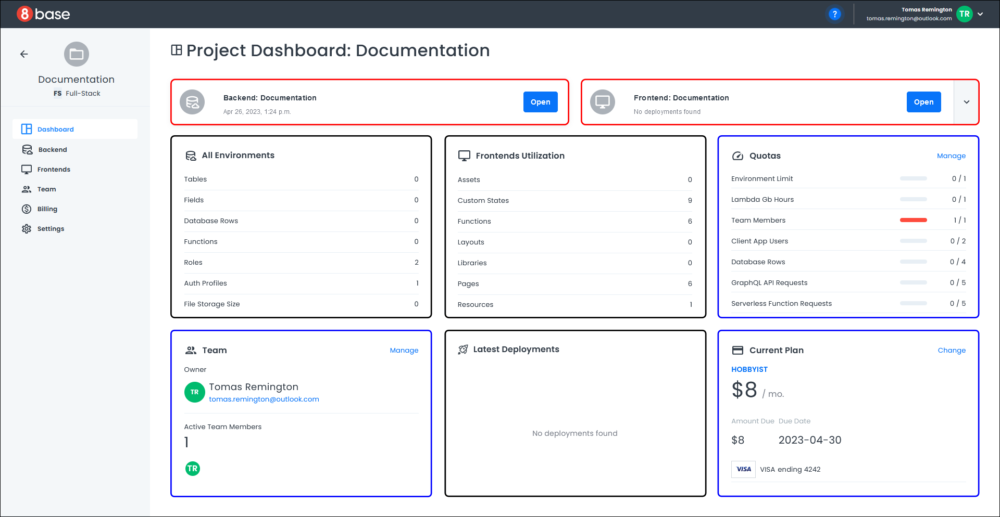

	Legend: Application(s) (red border) | Information (black border) | Project Settings (blue border)
 
#### Backend Application
To launch your backend application, click the "Open" button on the project dashboard next to the backend name. The backend application opens in a new browser tab. Here you can view your application quotas, start building your data model, define functions, set up user roles, use the API explorer to create GraphQL queries, and get help from the 8base community.

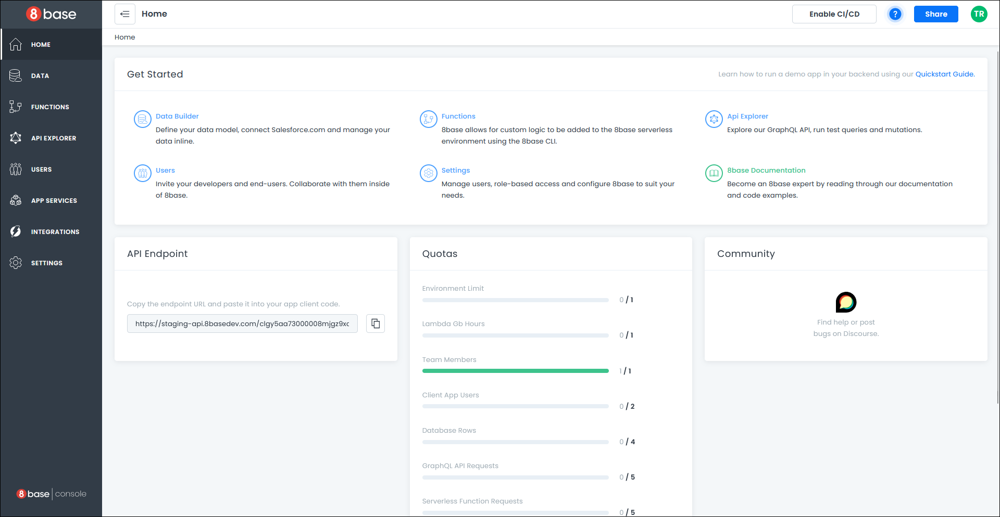

#### Frontend Application
To launch your frontend application, click the "Open" button on the project dashboard next to the frontend name. The App Builder opens in a new browser tab, and you can now begin designing your frontend application.

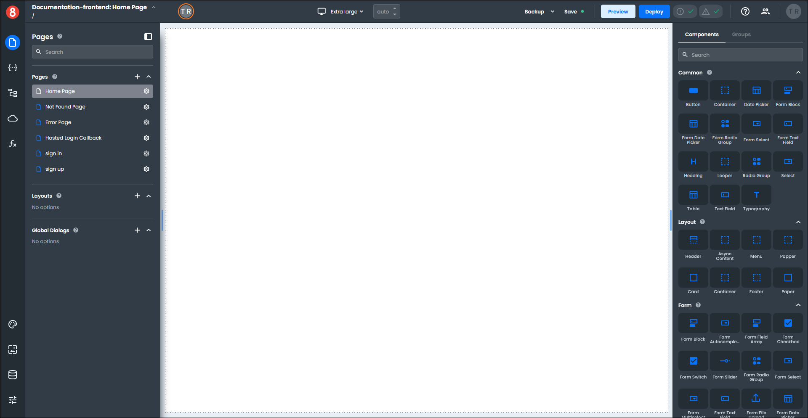

If you have more than one frontend, click the down arrow next to the current frontend name, this displays a list of all your frontends. A link to add a new frontend is at the bottom of the list (see <a href="#adding-a-frontend">Adding a Frontend</a>).

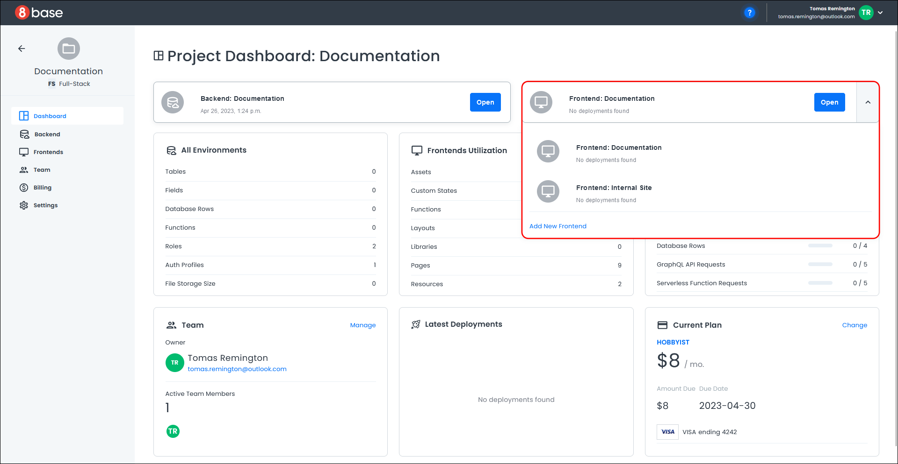

Select the frontend you want to work with and click the "Open" button. The App Builder opens in a new browser tab (as seen above).

#### All Environments
The project dashboard's *All Environments* area provides information about your project roles, authorization profiles, file storage size, and database information for your backend application. There will only be database information if you have a backend application.

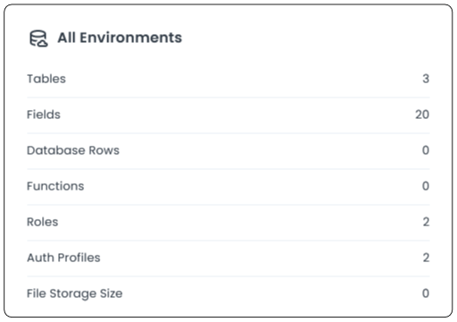

#### Frontends Utilization
The project dashboard's *Frontends Utilization* area provides information about the assets, layouts, libraries, pages, etc., used by your frontend applications.

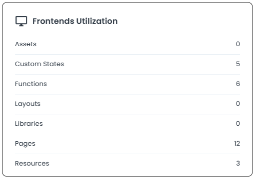

#### Quotas
The project dashboard's *Quotas* area provides usage data and limits on different aspects of your project, such as the environment limit, number of team members, client user apps, and database rows. You can also access your *Billing* information.

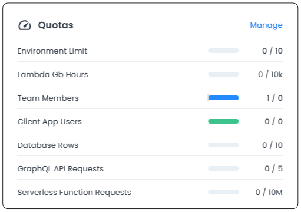

To manage your *Billing* information, click the "Manage" link next to the quotas heading. A page opens with information about your payment method, project usage, billing period, and billing history. 

Click the "Update" button in the Payment Methods section to update your payment details. A pop-up opens to allow you to change your payment details.

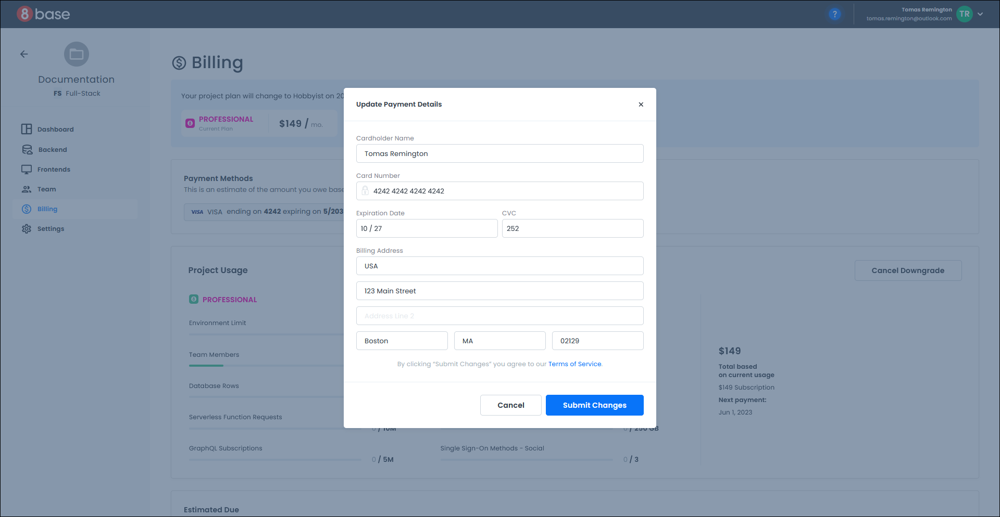

Click the "Change Plan" button in the Project Usage section to change your payment plan. A pop-up opens that walks you through the steps of changing your plan.

Click "View" next to your current statement in the Billing History section to view a copy of your bill. A PDF of your bill opens in a new browser tab.

#### Team
To manage your project *Team*, click the "Manage" link on the project dashboard next to the team heading. A page opens with information about your current project's team members.

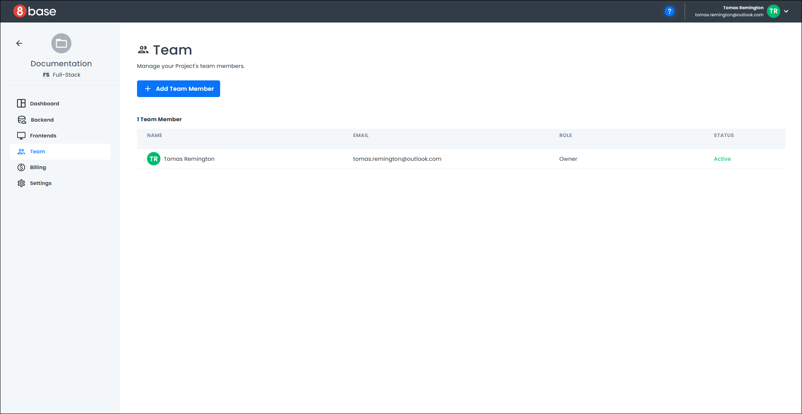

To add a new team member, click the "Add a Team Member" button, which opens a pop-up that allows you to add a new team member to your project.

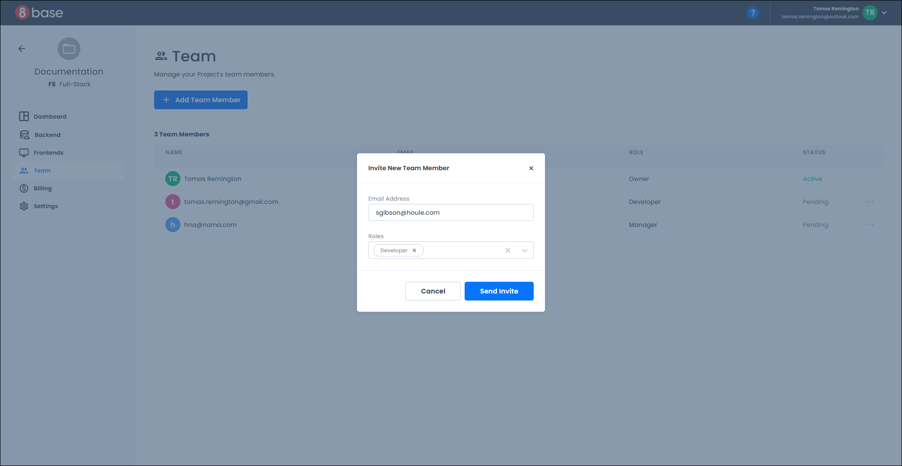

Complete the form in the pop-up and click "Send Invite". A notification displays, indicating the cost for adding a new team member.

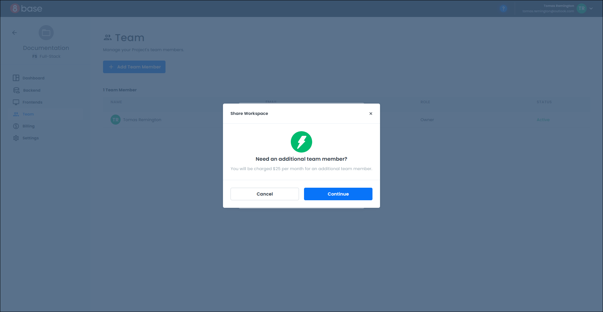

Click "Cancel" to cancel adding the team member and close the notification.

Click "Continue" to send the invitation and close the notification. A confirmation message at the bottom of the *Team* page indicates the invitation was sent.

The next time you login and view the *Team* page, the new team member's name will be listed. Team members who have yet to accept an invitation have a status of *Pending*.

#### Latest Deployments
The project dashboard's *Latest Deployments* area provides information about your frontend deployments over the last week. The date and time of deployment, the current application version, and the project name are all displayed.

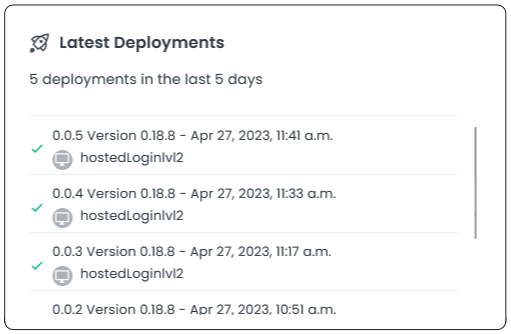

#### Current Plan
If you want to change your current plan, click on the "Change" link on the project dashboard next to the *Current Plan* heading. A pop-up opens and displays the available plans and your existing plan.

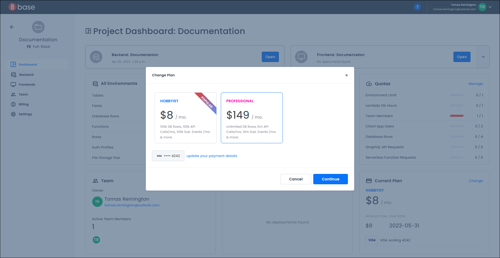

Click "Cancel" to abort changing your plan and the pop-up closes.

To select a new plan, click the "Continue" button. A confirmation dialog opens with your newly elected plan.

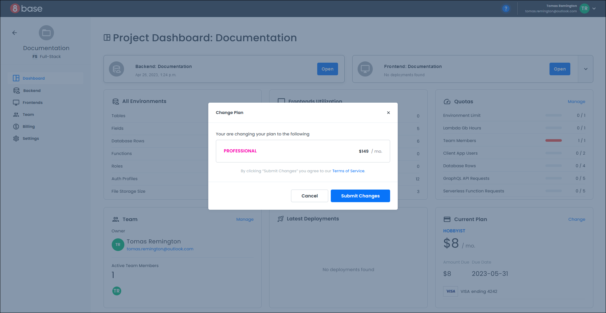

Click "Submit Changes" to process the payment for your new plan.

Your payment will be processed, the project dashboard will reload, and your new plan will appear under the *Current Plan* heading.

### Left-hand Menu
 The left-hand menu contains your project's name and links to access and launch your backend or frontend application, manage your team, view your billing information, or change your project settings.

#### Dashboard Link
The *Dashboard* link opens the project dashboard.

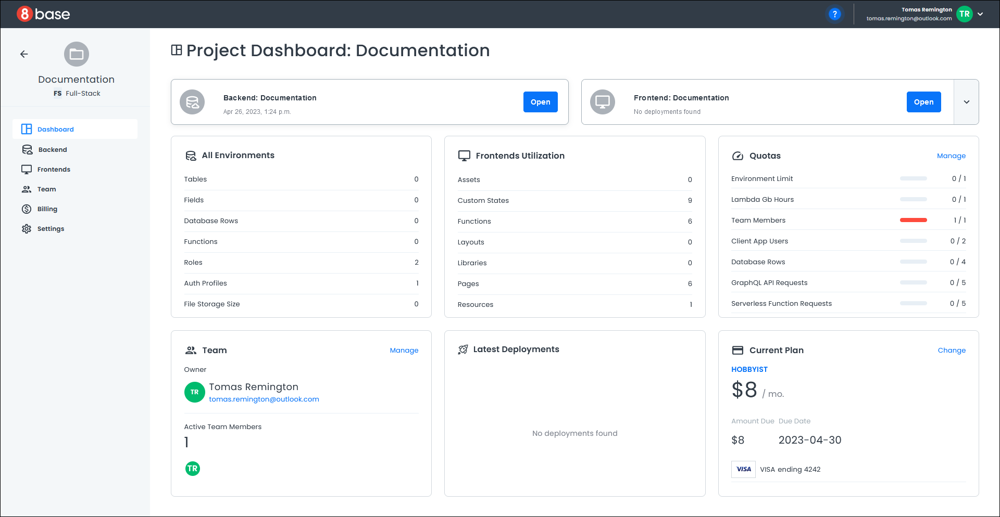

#### Backend Link
The *Backend* link opens a page with information about your backend, such as the Cloud Provider, Database Type, Endpoint, and the number of tables, functions, and fields in your database.

Click the "Open" button in the top right corner of the page to open your backend application in another browser tab.

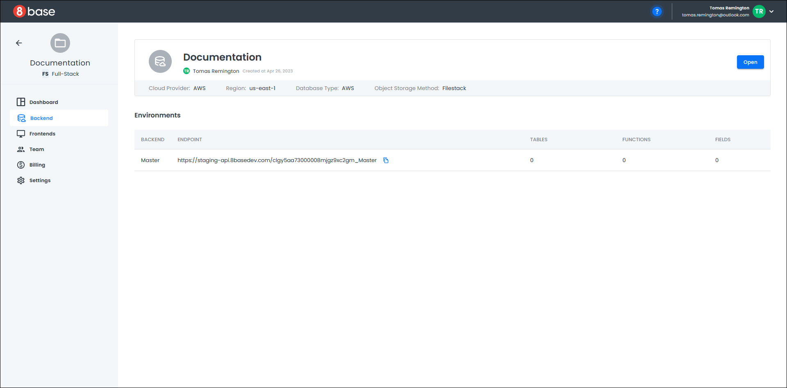

#### Frontends Link
The *Frontends* link opens a page listing your frontends and deployment information for each frontend. From this page, you can also add a new frontend (see <a href="#adding-a-frontend">Adding a Frontend</a>).

Click the "Open" button on one of your listed frontends to open your frontend in the App Builder. 

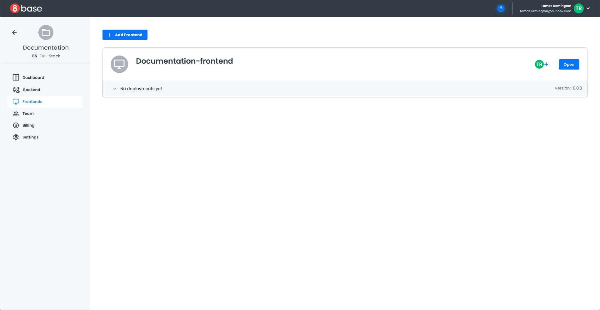

#### Team Link
The *Team* link opens a page with information on your project's team members. The workflow to manage your team is the same as from the *Team* section on the project dashboard.

#### Billing Link
The *Billing* link opens a page with billing information for your project. The workflow to manage your billing information is the same as from the *Quotas* section on the project dashboard.

#### Settings Link
The *Settings* link opens a page with information about your project, such as the project name, a description, and a custom project icon.

Directly within this page, you can change your project name and description. Remember to click "Save" to save any changes you make.

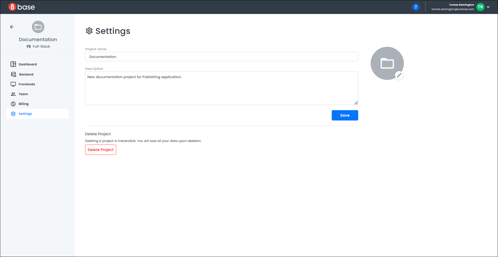

Click the icon next to the project information to change your project icon. A ***File Open*** dialog opens in a pop-up that allows you to select a new icon.

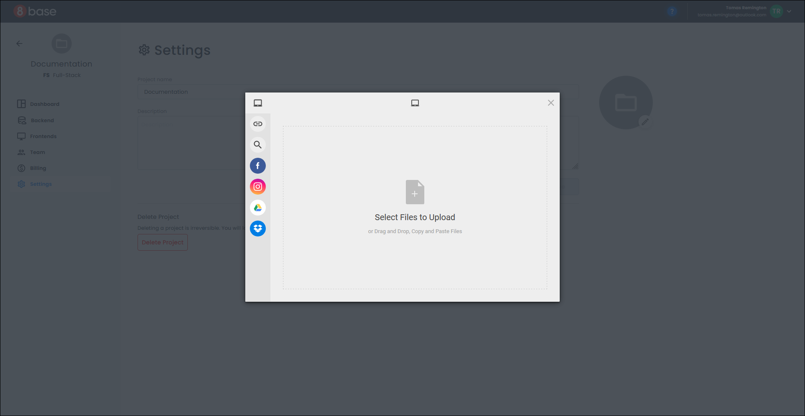

If you want to delete your project, click the "Delete" button, and a confirmation pop-up opens.

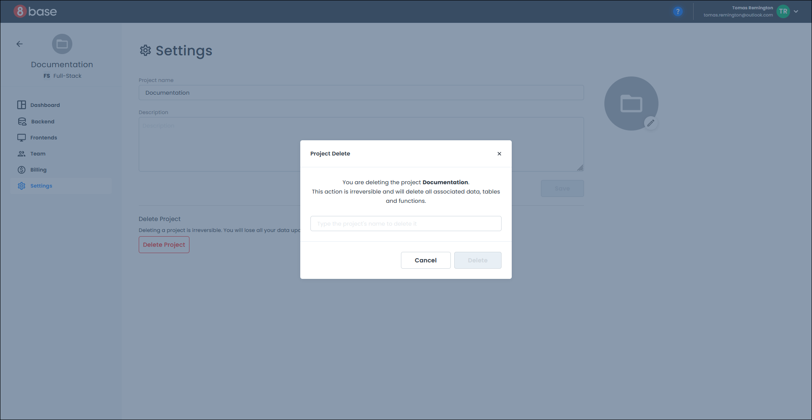

Click "Cancel" to cancel deleting the project and close the pop-up.

Enter the project name and click "Delete" to delete the project. A confirmation message indicates the project was successfully deleted, and you are redirected to the My Projects screen.

### <a id="adding-a-frontend">Adding a Frontend</a>
You can add a new frontend from either the *Project Dashboard* or the *Frontends Listing* page.

**Start Flow A:** *Project Dashboard > Frontend Drop-down List*

Click the down arrow next to the current frontend name on the project dashboard. A list of all your frontends displays; click "Add New Frontend" at the bottom of the list.

**Start Flow B:** *Menu > Frontend Listing*

Click the *Frontends* link on the menu to open the *Frontend Listing* page. Click the "Add Frontend" button in the upper left corner of the page.

**Common Flow:**

A pop-up opens for you to input the name of your frontend and enable integrated authentication if required.

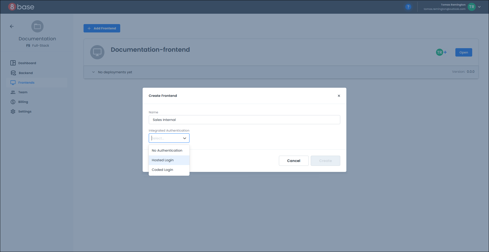

Click the "Cancel" button to cancel adding a frontend and close the pop-up.

Click the "Create" button to bring up the *Frontend Creator*, which steps through creating your new frontend. 

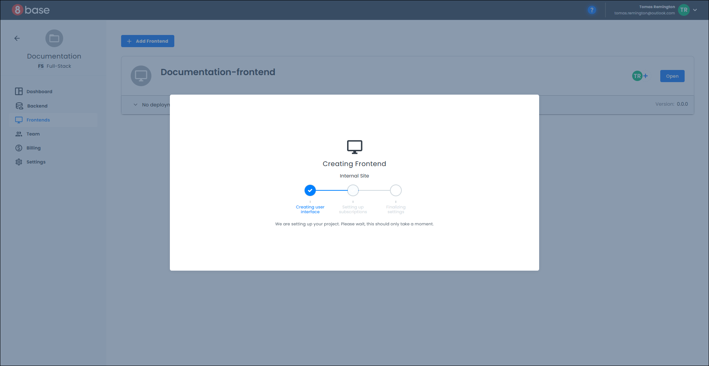

The *Frontend Creator* closes once your new frontend is ready.

**End Flow A:**

Your new frontend displays in the frontend drop-down list on the *Project Dashboard*.

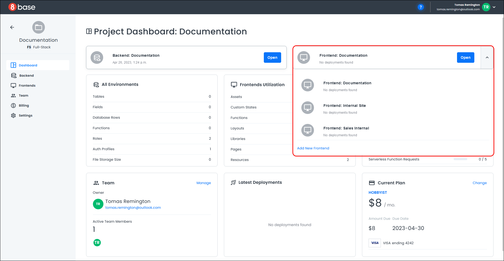

**End Flow B:**

Your new frontend displays on the *Frontend Listing* page.

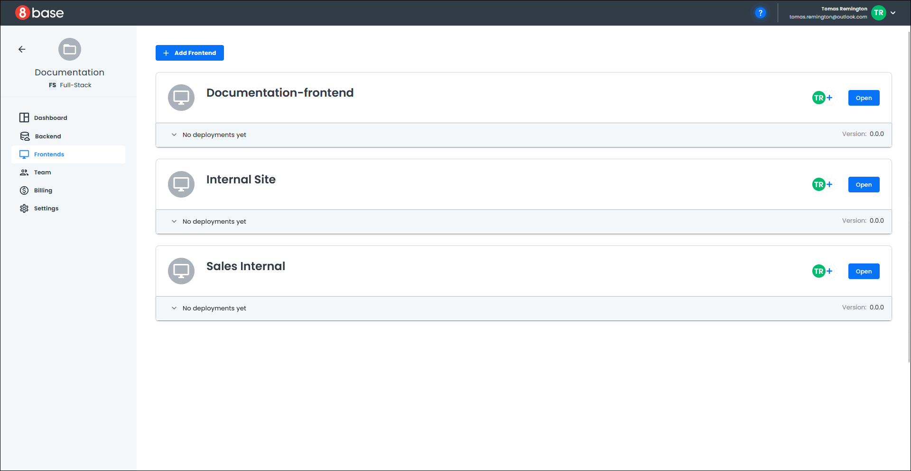

