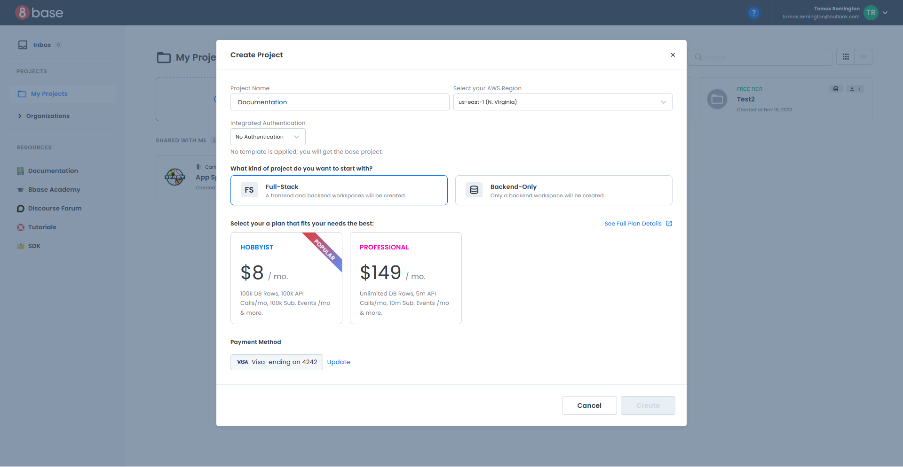
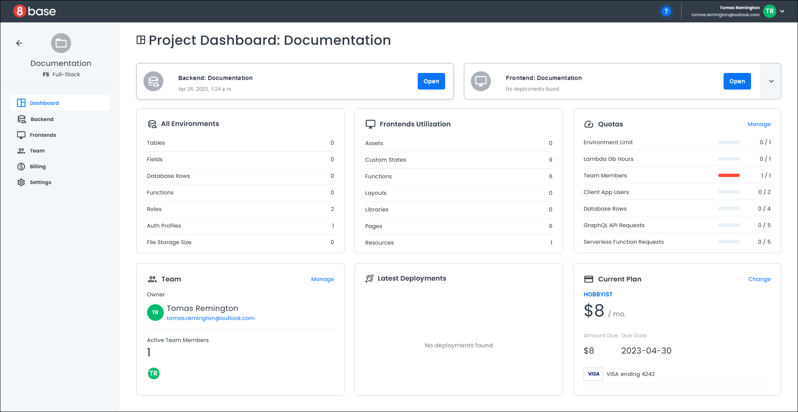

# Provisioning Projects
Provisioning projects in 8base can be done in a few simple steps and allows you to set up Full-Stack or Backend-Only projects in seconds.
_______

## Creating a Project
After you login, the *My Projects* page loads and displays a list of all your projects. This page will be blank if you have not yet created any projects. 

:::note
Before creating your first project, you should set up your payment details. You will be prompted during the project creation process if you still need to do this.
:::

To create a new project:
+ Click "Create Project" in the upper left corner of the My Projects page.
+ A new pop-up opens for you to enter your project details.
+ Enter a unique name for your project.
+ Choose your AWS region, either East or West.
+ Choose your Integrated Authentication type.
	+ **No Authentication** - your project will not use authentication.
	+ **Hosted Login** - a default 8base authentication profile is created for your project. 
	+ **Coded Login** -  a default authentication profile along with Sign In and Sign Up pages are created for your project. 
+ Choose your project type:
	+ **Full-Stack** - frontend and backend workspaces will be created.
	+ **Backend-Only** - only a backend workspace will be created.
+ Choose your payment plan.
+ Click the "Create" button.

The project creator pop-up opens and steps through setting up your project. Once the project creator has finished the setup, it will automatically close.

If your project uses authentication, a new pop-up opens indicating that you must install a *Template* to set up your authentication.

Click "OK" to close the pop-up and your project dashboard is displayed. 

You can find instructions on how to set up your *Template* by clicking the **Help** icon at the top of the *Project Dashboard* and selecting "View Template Instructions", which opens the 8base documentation site in a new browser.

Check out the article **Project UI Walkthrough** to get familiar with the *Project Dashboard*.

